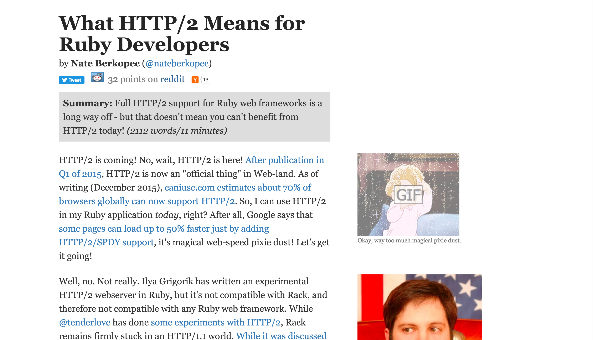

autoscale: true


---

# [fit] Rails
# [fit] in 140 characters
# [fit] or less

with @nateberkopec

---


---


---

# [fit] Not
# [fit] Actually
# [fit] Magic

---



---

# [fit] nateberkopec.com

---


---

# [fit] railsspeed.com

---


^ Which of these adjectives do you think apply to Rails (the framework)?

---

# [fit] bloated
### or
# [fit] lightweight


---


---

# [fit] well-architected
### or
# [fit] spaghetti


---

> ActionController [is a] Crack Den of Inheritance
-- Chad Meyers, lostechies.com

---

# [fit] object-oriented

---

> [Lotus] aims to bring back Object Oriented Programming to web development
-- Lotus (now Hanami) web framework

---


---

# [fit] modular
### or
# [fit] monolithic


---

> There are many people on StackOverflow who complain about CSRF not working, and the common advice is to turn off CSRF protection — surely that by itself is proof that people should only turn this on when they need it?
-- Smash Company, http://www.smashcompany.com/

---

# SSL breaks things.
# Everyone should
### `OpenSSL::SSL::VERIFY_PEER = OpenSSL::SSL::VERIFY_NONE.`

---

# [fit] fast
### or
# [fit] slow


---


---

#### [fit] what's that sound?

---


---

# [fit] railsspeed.com

---

---

# [fit] railsspeed.com

---

# [fit] Thesis
### Rails is a **_lightweight_**, **_well-architected_** and **_modular_** framework for creating **_speedy_** web applications - but it doesn't advertise itself that way.

---


---

# [fit] `rails new` -> 1 tweet

---

```ruby
class HelloWorldController
  def index
    render plain: "Hello World!"
  end
end
```

---

# [fit] 433 LOC / 61 files

---

# [fit] Step 1:
# [fit] delete empty folders and files.

---

```
 app/assets/images/.keep               | 0
 app/assets/javascripts/channels/.keep | 0
 app/controllers/concerns/.keep        | 0
 app/models/concerns/.keep             | 0
 lib/assets/.keep                      | 0
 lib/tasks/.keep                       | 0
 log/.keep                             | 0
 test/controllers/.keep                | 0
 test/fixtures/.keep                   | 0
 test/fixtures/files/.keep             | 0
 test/helpers/.keep                    | 0
 test/integration/.keep                | 0
 test/mailers/.keep                    | 0
 test/models/.keep                     | 0
 tmp/.keep                             | 0
 vendor/assets/javascripts/.keep       | 0
 vendor/assets/stylesheets/.keep       | 0
 17 files changed, 0 insertions(+), 0 deletions(-)
```

---

```
README.md                                              | 24 --------------
app/helpers/application_helper.rb                      |  2 --
app/jobs/application_job.rb                            |  2 --
app/mailers/application_mailer.rb                      |  4 ---
app/views/layouts/mailer.html.erb                      | 13 --------
app/views/layouts/mailer.text.erb                      |  1 -
config/initializers/application_controller_renderer.rb |  6 ----
config/initializers/backtrace_silencers.rb             |  7 ----
config/initializers/inflections.rb                     | 16 ----------
config/initializers/mime_types.rb                      |  4 ---
config/locales/en.yml                                  | 23 --------------
db/seeds.rb                                            |  7 ----
public/404.html                                        | 67 ---------------------------------------
public/422.html                                        | 67 ---------------------------------------
public/500.html                                        | 66 --------------------------------------
public/apple-touch-icon-precomposed.png                |  0
public/apple-touch-icon.png                            |  0
public/favicon.ico                                     |  0
public/robots.txt                                      |  5 ---
test/test_helper.rb                                    | 10 ------
20 files changed, 324 deletions(-)
```

---

# [fit] Empty
# [fit] !=
# [fit] Worthless

^ The value of the placeholder/folder structure
^ Prevents bikeshedding

---

# [fit] Step 2:
# [fit] Delete `app`

---

```
app/assets/config/manifest.js                |  3 ---
app/assets/javascripts/application.js        | 16 ----------------
app/assets/javascripts/cable.js              | 13 -------------
app/assets/stylesheets/application.css       | 15 ---------------
app/channels/application_cable/channel.rb    |  5 -----
app/channels/application_cable/connection.rb |  5 -----
app/controllers/application_controller.rb    |  5 -----
app/controllers/hello_controller.rb          |  5 -----
app/models/application_record.rb             |  3 ---
app/views/layouts/application.html.erb       | 14 --------------
config/application.rb                        |  8 ++++++++
11 files changed, 8 insertions(+), 84 deletions(-)
```

---

```
--- a/config/application.rb
+++ b/config/application.rb
@@ -13,3 +13,11 @@ module Tweetlength
     # -- all .rb files in that directory are automatically loaded.
   end
 end
+
+class HelloController < ActionController::Base
+  protect_from_forgery with: :exception
+  
+  def world
+    render plain: "Hello World!"
+  end
+end
```

---

# [fit] Step 3:
# [fit] Delete `bin`

---

```
bin/bundle |  3 ---
bin/rails  |  9 ---------
bin/rake   |  9 ---------
bin/setup  | 34 ----------------------------------
bin/spring | 15 ---------------
bin/update | 29 -----------------------------
```

---

# [fit] What's a binstub?

---

```ruby
require 'bundler/setup'
load Gem.bin_path(path_to_gem_executable)
```

---

```ruby
app = Rack::Builder.new { ... config.ru ... }.to_app
```

---

```ruby
require ::File.expand_path('../config/environment', __FILE__)
run Rails.application
```

---

# [fit] Step 4:
# [fit] Use What You Need

—

```
--- a/config/application.rb
+++ b/config/application.rb
@@ -1,6 +1,15 @@
 require_relative 'boot'

-require 'rails/all'
+require 'rails'
+
+# require "active_record/railtie"
+require "action_controller/railtie"
+# require "action_view/railtie"
+# require "action_mailer/railtie"
+# require "active_job/railtie"
+# require "action_cable/engine"
+# require "rails/test_unit/railtie"
+# require "sprockets/railtie"
```
---

```ruby
require 'rails'

%w(
  active_record/railtie
  action_controller/railtie
  action_view/railtie
  action_mailer/railtie
  active_job/railtie
  action_cable/engine
  rails/test_unit/railtie
  sprockets/railtie
).each do |railtie|
  begin
    require railtie
  rescue LoadError
  end
end
```

---

> Rails will become more modular, starting with a rails-core, and including the ability to opt in or out of specific components.
-- Yehuda Katz, 2008

^ History lesson!
^ Rails 3 release in August 2010

---

> All forward progress stalled for nearly two years, it's *still* slower than Rails 2, Bundler is a nightmare, Node.js won
-- Jeremy Ashkenas, 2012

^ Its not slower anymore, bundler is awesome
^ but he's right about forward progress

---

```
Gemfile      | 45 ---------------------------------------------
Gemfile.lock | 62 --------------------------------------------------------------
2 files changed, 107 deletions(-)
```

---

```
config/cable.yml    | 10 ----------
config/database.yml | 25 -------------------------
config/puma.rb      | 47 -----------------------------------------------
config/spring.rb    |  6 ------
4 files changed, 88 deletions(-)
```

---

# [fit] Step 5:
# [fit] Inline everything

---

# Inline into config.ru

* config/boot.rb
* config/environment.rb
* config/application.rb
* config/environments/production.rb

---

```ruby
require "action_controller/railtie"

module Tweetlength
  class Application < Rails::Application
    config.secret_key_base = "X"

    routes.draw do
      root to: "hello#world"
    end
  end
end

class HelloController < ActionController::Base
  def world
    render plain: "Hello World!"
  end
end

Rails.application.initialize!

run Rails.application
```

---


---


```ruby
require "action_controller/railtie"

module Tweetlength
  class Application < Rails::Application
    config.secret_key_base = "X"

    routes.draw do
      root to: "hello#world"
    end
  end
end

class HelloController < ActionController::Base
  def world
    render plain: "Hello World!"
  end
end

Rails.application.initialize!

run Rails.application
```

---

# The middleware stack

```
use Rack::Sendfile
use ActionDispatch::LoadInterlock
use ActiveSupport::Cache::Strategy::LocalCache::Middleware
use Rack::Runtime
use Rack::MethodOverride
use ActionDispatch::RequestId
use Rails::Rack::Logger
use ActionDispatch::ShowExceptions
use ActionDispatch::DebugExceptions
use ActionDispatch::RemoteIp
use ActionDispatch::Callbacks
use ActiveRecord::ConnectionAdapters::ConnectionManagement
use ActiveRecord::QueryCache
use ActionDispatch::Cookies
use ActionDispatch::Session::CookieStore
use ActionDispatch::Flash
use Rack::Head
use Rack::ConditionalGet
use Rack::ETag
```

^ Rack Sendfile lets our web server (nginx) serve static assets instead of our app server
^ Activesupport adds some real basic caching for when we call cache in the app
^ Rack::Runtime sets X-Runtime
^ RemoteIp prevents IP spoofing attacks, any client can claim to have any IP address by setting the X-Forwarded-For header. we dont need this on heroku w/ssl.

---

# [fit] config.api_only

---

```ruby
config.middleware.delete ::Rack::Sendfile
```

---

# [fit] ActionController::Metal


---

```ruby
module ActionController
  class Base < Metal
    MODULES = [
      AbstractController::Rendering,
      AbstractController::Translation,
      AbstractController::AssetPaths,

      Helpers,
      #...
    ]
  end
  MODULES.each do |mod|
    include mod
  end
end
```
---

AbstractController::Rendering,AbstractController::Translation,AbstractController::AssetPaths,Helpers,HideActions,UrlFor,Redirecting,ActionView::Layouts,Rendering,Renderers::All,ConditionalGet,EtagWithTemplateDigest,RackDelegation,Caching,MimeResponds,ImplicitRender,StrongParameters,Cookies,Flash,RequestForgeryProtection,ForceSSL,Streaming,DataStreaming,AbstractController::Callbacks,Rescue,Instrumentation,ParamsWrapper...

---


---

```ruby
class HelloController < ActionController::Metal
  def index
    self.response_body = "Hello World!"
  end
end
```

---

# All controllers are also Rack apps

```ruby
require "action_controller"

class HelloController < ActionController::Base
  def world
    render plain: "Hello world!"
  end
end

run HelloController.action(:world)
# get 'hello', 'hello#index'
# get 'hello', to: HelloController.action(:index)
```

---

# Rack App Review

```ruby
  Proc.new { [200,[],["Hello world!"]]
```

---

# Rails' Router Isn't Rails-Specific

```ruby
Rails.application.routes.draw do
  get "/sinatra", to: SomeSinatraApp
  get "/hanami", to: SomeHanamiApp
  root to: Proc.new { [200,[],["Hello world!"]]
end
```

---

```ruby
class MyBaseController < ActionController::Metal
  ActionController::Base.without_modules(:ParamsWrapper, :Streaming).each do |left|
    include left
  end
end
```

---

# Models need not be ActiveRecord

```ruby
module ActiveRecord
  class Base
    extend ActiveModel::Naming

    extend ActiveSupport::Benchmarkable
    extend ActiveSupport::DescendantsTracker

    extend ConnectionHandling
    # ...
```
---

# [fit] The performance story

Save ~35MB of RSS and ~20ms/request

---

# [fit] Framework code < App code

---

# [fit] Code golf!

---

```ruby
require "action_controller/railtie"

module Tweetlength
  class Application < Rails::Application
    config.secret_key_base = "X"

    routes.draw do
      root to: "hello#world"
    end
  end
end

class HelloController < ActionController::Base
  def world
    render plain: "Hello World!"
  end
end

Rails.application.initialize!

run Rails.application
```

---


---

```bash
rackup \
-r action_controller/railtie \
-b 'run Class.new(Rails::Application){config.secret_key_base=?x}.initialize!'
```

---

# Is this even practical?

* Test suites for gems/engines
* API only or other specialized applications

---

# [fit] most production web applications
# [fit] need 80% of what Rails provides

---

# [fit] Rails is modular
# [fit] You just never needed it

---

# Your homework

* Don't use rails/all (`derailed_benchmarks` and `ab`)
* Consider ActionController::Metal and ActiveModel
* Try starting from a single file the next time your start a Rails app

---

github.com/nateberkopec/tweetlength
github.com/nateberkopec/rails_lightweight_stack
railsspeed.com
The Complete Guide to Rails Performance
twitter/github: @nateberkopec

---

# Expanding: ActiveModel

```ruby
class Article
  extend  ActiveModel::Naming
  extend  ActiveModel::Translation
  include ActiveModel::Validations
  include ActiveModel::Conversion
  attr_accessor :id, :name, :content

  def self.all
    @articles ||= []
  end

  ...etc
end

```

---

# Expanding: ActiveRecord

* Add config/database.yml
* Set up your database
* Require ActiveRecord
* Add a Rakefile and call ```Rails.application.load_tasks```

---

# Expanding: ActionView

```ruby
class HelloController < ActionController::Metal
  include AbstractController::Rendering
  include ActionController::Rendering
  include ActionView::Layouts
  append_view_path "#{Rails.root}/app/views"

  def index
    render "hello/index"
  end
end
```

---

# Expanding: Rails Server

* Add back bin/rails and you're set

---

# Expanding: ActionMailer

* Just require ActionMailer and get to it

---

# Expanding: Tests

* You can do tests in-file, or just require the test support (or your favorite test gem) and hop to it
xq